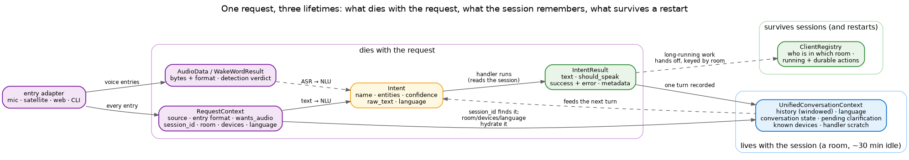

# Data models

[Data flow](dataflow.md) walks *where* a request travels; this page catalogues *what* it travels as —
the handful of objects that carry it, and above all **how long each one lives**. Almost every confusion
about state in Irene reduces to one question: is this thing per-request, per-session, or durable?

## Dies with the request

**`RequestContext`** is the envelope every entry adapter builds: where the request came from (mic,
satellite, web, CLI), which stage it enters the pipeline at (spoken audio that needs waking, audio
that's already triggered, or plain text), whether the caller wants audio back, and the request's
*identity* — the session id, the room, the devices near the speaker, an explicit language if the caller
set one. It is routing and identity, never memory: nothing stores it, and it's gone when the request
returns. If you're tempted to stash something on it for later, it belongs in the session instead.

**`AudioData`** and **`WakeWordResult`** exist only inside the audio front-end: a chunk of sound with
its format, and the wake-word verdict on it. Both are consumed on the spot — by the time text exists,
they're gone (see [the audio front-end](dataflow.md#the-audio-front-end)).

**`Intent`** is what understanding produces: a name (`timer.set`), the extracted entities, a
confidence, and the language of the turn. `raw_text` always carries the *literal* utterance, even
though matching runs on normalized text — so anything downstream that needs the user's actual words
still has them. Deliberately absent: a session id. An intent doesn't know what conversation it's part
of; the context alongside it does.

**`IntentResult`** is what a handler returns: the reply text, whether to speak it, and a contract on
failure — an unsuccessful result must say *why*, so a failure can never travel silently. Its metadata
carries the turn's side-band facts: that a clarification was asked, what a device actually echoed back.

## Lives with the session

**`UnifiedConversationContext`** is the one session-scoped store, and the key insight is what a
"session" *is*: **a room, not a person**. The kitchen has one ongoing conversation regardless of who's
speaking or which device picked them up. Everything the *next* turn might need lives here: the recent
conversation history (a sliding window, written exactly once per turn), the conversation's language,
its state (idle, conversing, clarifying), a pending clarification waiting for its answer, the devices
known to be in the room, and per-handler scratch space. A session that goes quiet for about half an
hour expires — which is precisely why anything that must *outlive* it doesn't live here.

The bridge between the two worlds is deliberately narrow: the request's `session_id` finds (or mints)
the session, and the request's room, devices and language hydrate it on the way in. Only one code path
can create a session — a mistyped id returns nothing rather than silently spawning a parallel
conversation.

## Survives sessions — and restarts

Long-running work is handed off, not remembered. A five-minute timer, a running scenario — the handler
registers them in the **[client registry](client-registry.md)**, keyed by *physical identity* (the room
or device), and the conversation moves on. Sessions expire; rooms don't. That's how a timer set an hour
ago still knows which room to speak in after the conversation that created it is long gone — and, for
actions marked durable, even after a restart.

## The rule of thumb

When deciding where a piece of state belongs:

- About **this delivery** — where it came from, where the answer goes, what format? The request.
- Needed by **the next turn** — history, an unanswered question, the turn's language? The session.
- Must outlive the conversation — anything with a **future obligation**? The registry, keyed by room.
