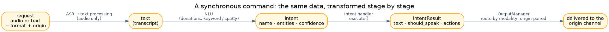
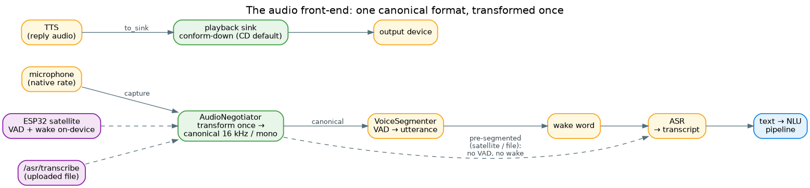
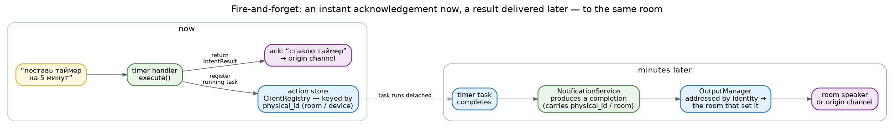

# Data flow

Trace a request and you watch the same intent take a few shapes: a string, then an `Intent` (a name and
some entities), then an `IntentResult`, then bytes on a channel. This page walks the cases that aren't
obvious from the pipeline alone; the shapes themselves — and how long each one lives — are catalogued
in [Data models](data-models.md).

## A synchronous command

The common case — "который час", a light toggle, a question — finishes in one turn:

1. The request arrives as audio or text, carrying its format and origin. Audio becomes text via ASR and
   the text processor; text skips straight past those.
2. **NLU** turns the text into an `Intent` — a name (`datetime.current_time`), entities and a confidence —
   driven by the donation files: a cheap keyword match first, spaCy when it's hard (see [NLU](nlu.md)).
3. The matched **handler** runs and returns an `IntentResult`: the reply text, whether to speak it, any
   actions.
4. The **OutputManager** sends it back to the channel that asked, picking the modality and degrading
   speech to text where a channel can't speak.

Voice and text differ only at step 1 — *where* they enter; from NLU onward the path is identical. When a
handler needs something it doesn't have — an LLM that's offline, a device that isn't there — it doesn't
crash: it returns a spoken explanation or asks a clarifying question.

## The audio front-end

Step 1 hides a small pipeline of its own — how raw audio becomes that transcript:

- **One canonical format, transformed once.** The `AudioNegotiator` derives a single internal format (16 kHz /
  mono for voice) from what the consumers need, and transforms the capture to it **once** at the boundary — a
  44.1 / 48 kHz mic is downsampled there, never up. VAD, wake word and ASR all then see canonical audio, and a
  combination that can't be satisfied is a fatal error at startup, not a silent mismatch.
- **VAD → wake → ASR.** With a local mic, the `VoiceSegmenter` runs VAD to cut the endless chunk stream into
  utterances; each utterance is checked for the wake word, then transcribed. The pre-roll (audio kept *before*
  the trigger) is sized from the active VAD engine's detection latency so the onset is never clipped.
- **Pre-segmented inputs skip VAD and wake.** An **ESP32 satellite** does VAD and the wake word *on-device* and
  streams a finished utterance (`/ws/audio`, bounded by an end frame — with a hard per-utterance length cap as
  a safety net, so a device that never signals the end can't grow the server's buffer); an uploaded file (`/asr/transcribe`) is
  one utterance by definition. Both still flow through the negotiator (so they're conformed), then go straight
  to ASR — VAD and wake are exactly the work the device already did.
- **Output is the mirror.** A reply's audio (TTS) is conformed **down** to the playback **sink** — the device's
  capability, CD by default — through the same machinery: any device plays lower, so it's never upsampled.

See [VAD](../guides/vad.md), [voice trigger](../guides/voice-trigger.md) and [audio](../guides/audio.md) for
the knobs, and the [WebSocket API](../guides/websocket-api.md) for the wire protocols a device speaks.

## Fire-and-forget, and deferred results

Some commands can't finish in one turn — a five-minute timer, a long-running action. These split in two:

- **Now** — the handler launches the work as a detached task, registers it in the
  **[action store](client-registry.md)** (`ClientRegistry`) keyed by the request's **physical identity**
  (the room or device, not the conversation), and returns an instant acknowledgement.
- **Later** — when the task finishes, a completion is produced and handed to the OutputManager, addressed
  by that same physical identity. The result speaks in **the room that set the timer**, even though the
  conversation that started it is long gone.

Keying on the room/device rather than the conversation session is the whole trick: sessions expire, rooms
don't. A "стоп" said an hour later still finds the running task by the same key, and a fired timer still
knows where home is.
