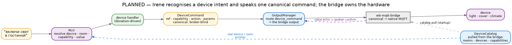
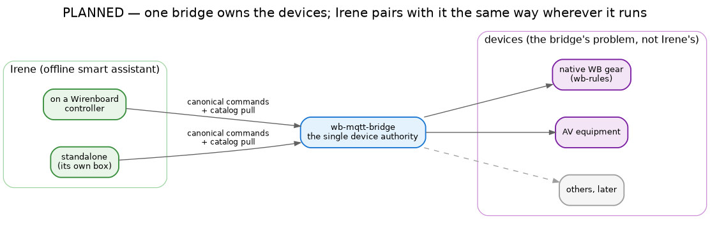

# MQTT integration (planned)

> **Status: designed, not yet built.** This describes how Irene will reach a smart home. Nothing here ships
> today; the implementation is tracked separately and lands on the architecture already in place.

## The decision in one line

Irene does not own device knowledge or MQTT conventions. A companion service, **`wb-mqtt-bridge`**, is the
single authority on what devices exist and how to talk to them. Irene recognises a command, resolves it to
**one canonical `DeviceCommand`**, and hands it over; the bridge translates that into the right native MQTT.
Irene stays blind to wb-rules versus Home Assistant versus anything else.

## From utterance to device

A device command isn't a special path — it's an ordinary intent whose *effect* leaves through the ordinary
output layer:

- **Recognition is just intents.** "включи свет в гостиной" is recognised like any other command, from a
  device handler's donations, by the same NLU. The harder grammar — a device, a room and a value in one
  sentence — is exactly what the spaCy tier is for (see [NLU](nlu.md)).
- **The room and device names are real** because Irene pulls a **catalog** from the bridge at startup —
  rooms, devices, capabilities — and feeds it to recognition. No hardcoded device list.
- **Actuation is just output.** The handler emits a `DeviceCommand` — a reference, a capability, an action,
  some params; no topic, no broker — and the OutputManager routes it, by modality, to the **bridge output**.
  The bridge actuates and echoes the result, which becomes the spoken confirmation.

So the two halves map cleanly onto the architecture: **intent in, canonical command out** — the bridge is
simply another output adapter, a request/response one.

## Platforms and pairing

The canonical vocabulary is small and device-shaped — `power`, `brightness`, `color`, `cover`, `climate`,
`sensor`, plus an AV set. Irene speaks only that; the bridge owns the mapping to native gear, so the same
Irene works whether it runs **on a Wirenboard controller** or as a **standalone box**. Either way it pairs
with `wb-mqtt-bridge` identically: canonical commands out, a catalog pull in.

One consequence worth noting: "выключи свет везде" isn't Irene looping over lights — it's one command to a
single aggregate device the bridge models. Irene never fans out; the controller does.
