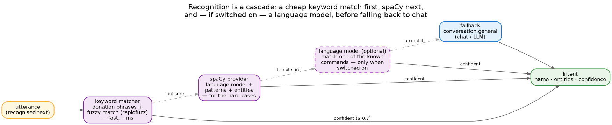
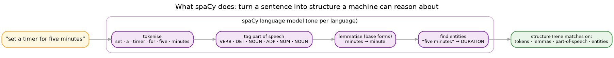

# NLU

NLU — natural-language understanding — is the step that turns a sentence into an `Intent`: a name like
`timer.set`, plus the entities it carries. Irene's guiding principle is **cheap first**: most commands are
simple and shouldn't pay for heavy machinery, so recognition is a cascade.

## The cascade

A request is tried provider by provider, stopping at the first one confident enough (the threshold is 0.7):

1. **Keyword matcher** — fast, runs in milliseconds. It compares the text against the `phrases` in the
   donations, with rapidfuzz fuzzy matching to forgive typos and small variations. This handles the easy
   ~80%: "привет", "который час", "поставь таймер".
2. **spaCy** — only when the keyword matcher isn't sure. It understands grammar and entities, so it catches
   the commands plain word-matching can't (more on it below).
3. **Language model** — an optional last resort, off unless a deployment turns it on. When the simpler
   tiers can't place an utterance, it asks a language model to match it to one of the known commands and
   pull out the details that command carries. A small device with no room for spaCy can lean on this
   instead; and if no language model is reachable it simply steps aside, so recognition still falls
   through to chat.
4. **Fallback** — if nothing recognises the utterance it becomes `conversation.general`, handled as chat
   (offline, or by an LLM when one is configured).

All three recognisers read the **same donations** — there is no separate "NLU model" to train. Add a
phrase or a pattern to a donation and every tier picks it up; the language-model tier simply takes that
list as the menu of commands it is allowed to choose from.

## What spaCy is

spaCy is an open-source library for understanding language. Where the keyword matcher only sees *words*,
spaCy sees *structure*. Given a sentence, it runs a small pipeline:

- **Tokenise** — split the sentence into words and punctuation.
- **Tag part of speech** — mark each token as a verb, noun, number, and so on.
- **Lemmatise** — reduce each word to its base form ("minutes" → "minute", "поставил" → "поставить"), so
  one rule covers every inflection.
- **Find entities** — pick out the meaningful spans: a duration, a place, a number.

The catch is that this needs a trained **language model** — a few hundred megabytes per language (for
Russian, `ru_core_news_md`). That is why spaCy is the *advanced* tier, and why adding a language means
adding its model (see [adding a language](../guides/howto-new-language.md)).

## How Irene uses it

The donations carry spaCy-side recognition too — `token_patterns` and `slot_patterns` written against
tokens, lemmas and parts of speech — and Irene builds spaCy matchers from them at startup. This is what
lets it handle the commands the keyword matcher can't: where word order matters, where the same word means
different things, or where one sentence packs a device, a room and a value together ("включи свет в
гостиной на половину"). Those richer tiers are the substrate the smart-home work builds on.

It all still comes from the donations — see [Intents](intents.md).
