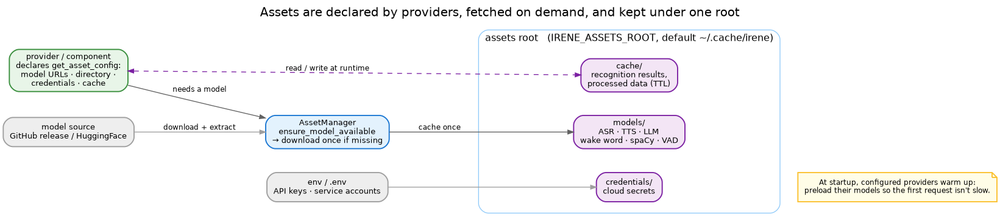

# Asset management

Anything heavy or secret that Irene needs at runtime — model files, cached computation, cloud credentials —
is an **asset**. They all live under one root and are fetched on demand, never bundled into the package.

## One root

Everything sits under `IRENE_ASSETS_ROOT` (default `~/.cache/irene`), in three buckets:

- **`models/`** — the ML files: ASR, TTS, local LLM, wake word, spaCy, VAD. These are the big ones
  (hundreds of MB), so they are downloaded once and reused.
- **`cache/`** — computation Irene can reuse: recognition results, processed patterns. Per-provider, with a
  TTL; safe to delete (it rebuilds itself).
- **`credentials/`** — file-based secrets for cloud providers (e.g. a Google service-account JSON). Most
  setups keep API keys in `.env` instead; this bucket is for the credentials that have to be files.

Point `IRENE_ASSETS_ROOT` at a data volume and the whole footprint moves with it.

## Declared, not hardcoded

A provider doesn't fetch its own files — it **declares** what it needs through `get_asset_config`: the model
URLs, which directory and file extension to use, the credentials it expects, the cache types it writes. The
**AssetManager** reads that declaration and does the rest. It is the same idea as donations: the provider
states its requirements, the framework satisfies them.

## Fetched on demand

The first time a *configured* provider needs a model, `AssetManager.ensure_model_available` checks the root
and, if it is missing, downloads it — from a GitHub release or a HuggingFace repo — and extracts it. Nothing
is fetched for a provider you don't use, which is half of why a deployment stays small (the other half is
the [build system](build-system.md)).

To avoid a slow first request, configured providers **warm up** at startup: they preload their models so the
model is already in memory before anyone asks.
