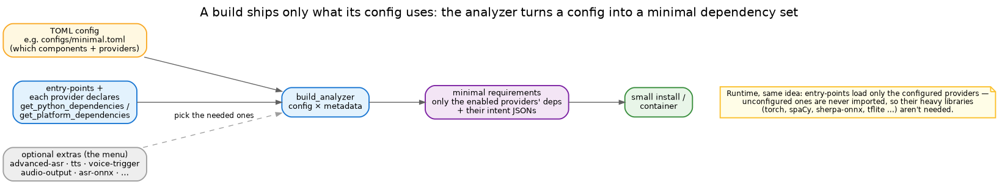

# Build system

A capable voice assistant can pull in some heavy company — PyTorch and Whisper for ASR, spaCy for NLU, ONNX
runtimes, TFLite for wake words. A text-only or API-only deployment shouldn't have to carry any of it. So in
Irene **the configuration decides the dependencies**, not a single monolithic requirements list.

## Dependencies are declared, per provider

Nothing heavy is a core dependency. Each provider **declares its own** — `get_python_dependencies` (the pip
packages) and `get_platform_dependencies` (system libraries, per OS) — and the matching libraries sit behind
optional **extras** in `pyproject.toml` (`advanced-asr`, `tts`, `voice-trigger`, `asr-onnx`, …). Install the
core and you have a working text assistant; add an extra and you add that capability.

## A build is computed from a config

You don't hand-pick extras. The **build analyzer** reads a config and works out exactly what it needs:



```
python -m irene.tools.build_analyzer --config configs/minimal.toml
```

It walks the enabled components and providers, collects their declared dependencies and the intent JSON files
they require, and produces the minimal set for that profile — which is what a container build then installs.
A `minimal.toml` deployment never lists torch; a voice profile lists only the speech libraries it actually
configured.

## Why it runs lean, too

The same mechanism that keeps the build small keeps the running process small. Providers are loaded through
**entry-points**, and only the ones the config enables are ever imported. A provider you didn't configure is
never touched — so its heavy libraries aren't imported, aren't in memory, and (thanks to the analyzer) need
not be installed at all. Configuration is the single lever for both.
