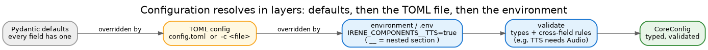
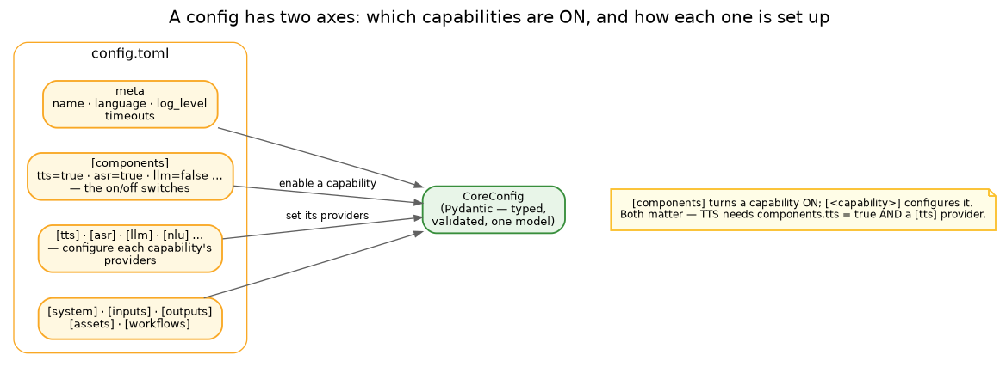

# Configuration

Irene's behaviour is driven by configuration, and there is exactly one shape for it: a single typed model,
`CoreConfig`. A TOML file fills it in, the environment can override it, and it is validated before anything
starts.

## How a config resolves

Three layers, lowest to highest precedence:

1. **Defaults** — every field in `CoreConfig` has one, so an empty config is still valid.
2. **The TOML file** — `config.toml`, or whichever you pass with `-c`. This is where most configuration
   lives.
3. **The environment** — any `IRENE_`-prefixed variable (in the shell or `.env`), with `__` marking a
   nested section: `IRENE_COMPONENTS__TTS=true` sets `components.tts`. Handy for secrets and per-host tweaks.

The merged result is **validated** — types are checked, and so are cross-field rules (enabling TTS without
Audio is rejected, not silently ignored). A bad config fails loudly at startup, not halfway through a request.

## The shape of a config

Two axes are worth keeping straight, because they are easy to confuse:

- **`[components]`** is the set of on/off switches — which capabilities exist at all (`tts`, `asr`, `llm`…).
- **`[tts]`, `[asr]`, `[llm]`, …** configure each capability: which providers it runs and their settings.

A capability needs both — `components.tts = true` *and* a `[tts]` section with a provider. The rest
(`[system]`, `[inputs]`, `[outputs]`, `[assets]`, `[workflows]`) plus the top-level meta (name, language, log
level, timeouts) round it out.

Three subsystems have dedicated guides for their knobs: [audio output](audio.md),
[voice activity detection](vad.md) and the [voice trigger](voice-trigger.md).

## Profiles

You rarely start from scratch. `configs/` ships ready-made profiles for common shapes — `minimal` and
`api-only` (text, no models), `voice` and `full` (the speech pipeline), `embedded-armv7` (a constrained
device) — and **`config-master.toml`**, the fully documented reference with every option explained. Copy the
closest one and trim it.

## One schema, two surfaces

The Pydantic model is not only for loading files. The browser config UI is generated from it — the same
`CoreConfig` fields become the editor's sections and inputs — so the schema is the single source of truth and
the UI can't drift from what the backend actually accepts.
