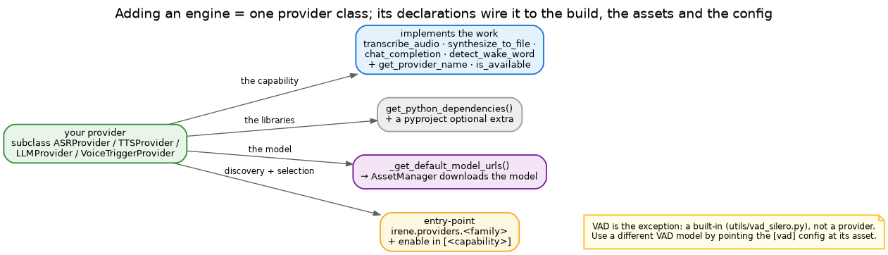

# Adding a model

Almost everything "AI" in Irene — wake word, ASR, TTS, the LLM — is a **provider**, and they all plug in the
same way. Adding an engine means writing one provider class and declaring three things: its libraries, its
model, and its name. (The one exception is VAD — see the end.)



## The recipe

Subclass the family's base — `ASRProvider`, `TTSProvider`, `LLMProvider` or `VoiceTriggerProvider` — and
implement its job. For ASR that job is `transcribe_audio`; for TTS `synthesize_to_file`; for an LLM
`chat_completion`; for a wake word `detect_wake_word`. Here is an ASR engine:

```python
from typing import List, Dict
from .base import ASRProvider

class MyASRProvider(ASRProvider):
    def get_provider_name(self) -> str:
        return "myasr"

    @classmethod
    def get_python_dependencies(cls) -> List[str]:
        return ["my-asr-lib>=1.0"]                      # the libraries this engine needs

    @classmethod
    def _get_default_model_urls(cls) -> Dict[str, str]:
        return {"base": "https://example.com/myasr-base.bin"}   # AssetManager fetches this on first use

    async def is_available(self) -> bool:
        return True                                     # check the lib + model are present

    async def transcribe_audio(self, audio_data: bytes, **kwargs) -> str:
        # ... run the model on the audio, return the text ...
        return text
    # ... plus the family's other abstract methods (streaming, supported languages, …)
```

The two `@classmethod` declarations are what keep it cheap: the dependencies are pulled only when this
provider is configured, and the model is downloaded on demand and cached (see [assets](asset-management.md)
and the [build system](build-system.md)).

## Wire it in

**1. Register** the entry-point in `pyproject.toml`:

```toml
[project.entry-points."irene.providers.asr"]
myasr = "irene.providers.asr.myasr:MyASRProvider"
```

**2. Add an extra** so its libraries are installable but optional:

```toml
[project.optional-dependencies]
asr-myasr = ["my-asr-lib>=1.0"]
```

**3. Enable it** in your config, then `uv sync`:

```toml
[components]
asr = true

[asr]
enabled = true
default_provider = "myasr"
fallback_providers = ["whisper"]
```

Provider-specific settings, if any, go in the same `[asr]` section — see `config-master.toml` for the full
key list. The other families work identically: swap `asr` for `tts` / `llm` / `voice_trigger` throughout.

## The exception: VAD

Voice activity detection is not a provider — it is a small `VADEngine` seam (`utils/vad.py`) with a handful
of built-in engines (`energy`, `silero`, `microvad`). To switch engines you don't write code; you set
`[vad] vad_implementation`. Adding a genuinely new one means a new `VADEngine` subclass, not a provider — see
the [VAD guide](vad.md).

## Try it

Enable the provider in a config and run it; the model downloads on first use. If it doesn't show up, check the
entry-point is registered and that you ran `uv sync`. For how providers sit under a component, see
[Components & providers](../architecture/components.md).

Two related guides: an LLM engine's **prompts** are authored separately (see [prompting](prompting.md)), and
the **playback** side of TTS has its own knobs (see [audio](audio.md)).
